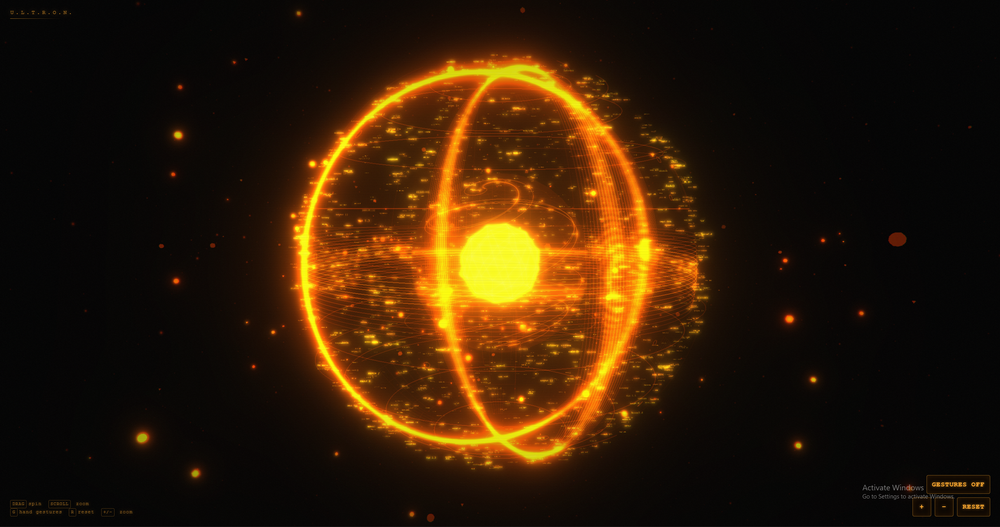

# ULTRON Orb UI

An Iron Man–inspired holographic orb built with **Next.js**, **Three.js**, and **MediaPipe** hand tracking — control it with your bare hands through your webcam.

> 🔮 This is the open-source **interface** of [ULTRON](https://sagartamang.com/projects/ultron) — my AI that talks in real time and controls Android devices by itself. **[Read the write-up](https://sagartamang.com/projects/ultron)** or **[the X post](https://x.com/sagar_builds/status/2077277583646101921)**

> 📱 **[Watch the demo on Instagram](https://www.instagram.com/p/DayJ17OTwvx/)**



https://github.com/user-attachments/assets/91578a83-9a27-44e8-84b0-96defcfd7366

## Getting started

```bash
npm install
npm run dev
```

Open [http://localhost:3000](http://localhost:3000).

## Controls

### Mouse / touch

| Input | Action |
| --- | --- |
| Drag | Spin the orb |
| Scroll / pinch | Zoom in & out |

### Hand gestures (webcam)

Click **GESTURES OFF** (or press `G`) and allow camera access, then:

| Gesture | Action |
| --- | --- |
| Pinch (thumb + index) one hand and move it | Spin the orb |
| Pinch with **both** hands, spread apart / bring together | Zoom in / out |

### Keyboard

| Key | Action |
| --- | --- |
| `G` | Toggle hand gestures |
| `R` | Reset the view |
| `+` / `−` | Zoom in / out |

## How it works

- **`lib/orbScene.ts`** — the Three.js scene: layered wireframe shells, a spiral
  inner core, floating code-text sprites, orbiting debris, dust particles, scan
  rings, and a bloom + chromatic-aberration post-processing stack.
- **`lib/handTracker.ts`** — MediaPipe HandLandmarker running on the webcam
  feed. Pinch detection with hysteresis: one pinched hand spins the orb, two
  pinched hands zoom by spreading apart or together.
- **`components/JarvisOrb.tsx`** — the HUD and glue between the scene, the
  tracker, and your inputs.

## License

MIT
